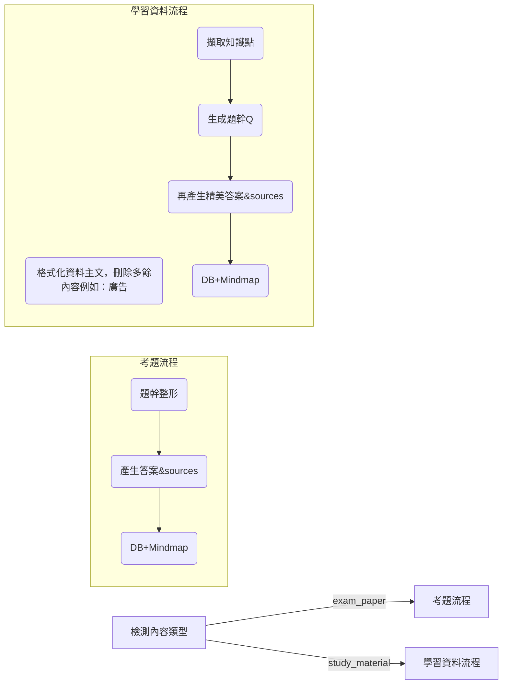

# 📌 AI Agent 第三版任務說明（修正版）：排版修正 & 參考答案精美化

> **目標**：目前功能大致完成，只剩**題幹程式碼縮排**與 **來源顯示失效** 三大瑕疵。  
> 本文件列出問題成因、修正策略、影響檔案以及更新後流程。**所有參考來源（考題與模擬題）都必須完整顯示**，請勿延伸其他開發範圍。

---

## ✅ 工作項目一覽

| 編號 | 必做項目 | 驗收標準 |
|------|----------|----------|
| **1** | **題幹程式碼縮排修正** | - 任意題幹的程式碼／虛擬碼經轉檔後，縮排與換行皆保留。不管來源是pdf還是圖片，程式碼/虛擬碼排版都會跑掉的問題，一定要修正。 |
| **2** | **來源 (sources) 全面顯示** | - 無論「考題」或「模擬題」的答案頁，皆能看到「參考來源」區塊並完整列出連結。 |

---

## 1️⃣ 題幹如果有程式碼/虛擬碼
應該要有程式碼區塊，同時注意縮排/排版問題
看看是否可以交由AI來處理格式化

---

##  來源資料不顯示（目前所有答案頁皆缺少）

* **須確定所有類型題目（考題／模擬題）的 `sources` 均寫入並在前端循環渲染**。 *

---

## 🛠️ 必改檔案清單

| 類別 | 檔案 / 模組 | 主要修改點 |
|------|-------------|-----------|
| **core** | `gemini_client.py` | 檢查或調整 `parse_exam_paper()` ＋ 檢查或調整確認提供資料來源 `generate_answer()` |
| **Utils** | `markdown_utils.py` | 確認圖片/PDF/文字有關題幹程式碼/虛擬碼處理 |
| **Utils** | `file_processor.py` | 確認圖片/PDF/文字有關題幹程式碼/虛擬碼處理 |
| **DB** | `database.py` / migration | 新增或確保 `sources` 欄位／關聯表 |
| **html** | `question_detail.html` | 確認參數傳遞，讓頁面能夠正常顯示 `📚 參考來源` ＋連結列表  |

---

## 🧬 程式流程參考

---

## 忽視以下檔案

- `REFACTORING_PLAN` 未來更新計畫，你不用管  
- `GEMINI.md` GEMINI agent檔案，你不用管  

---
