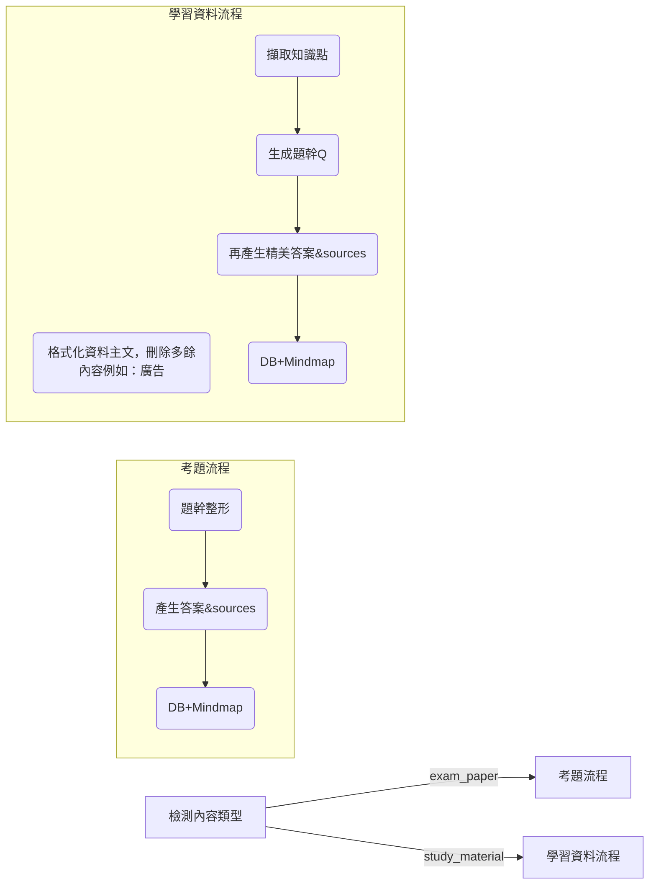

# 📌 AI Agent 第三版任務說明（修正版）：排版修正 & 參考答案精美化

> **目標**：目前功能大致完成，只剩 _程式碼縮排_、_模擬題參考答案_ 與 **來源顯示失效** 三大瑕疵。  
> 本文件列出問題成因、修正策略、影響檔案以及更新後流程。**所有參考來源（考題與模擬題）都必須完整顯示**，請勿延伸其他開發範圍。

---

## ✅ 工作項目一覽

| 編號 | 必做項目 | 驗收標準 |
|------|----------|----------|
| **1** | **題幹程式碼縮排修正** | - 任意題幹的程式碼／虛擬碼經轉檔後，縮排與換行皆保留。 |
| **2** | **模擬題參考答案精美化** | - 排版與考題解析一致：包含段落、列表、程式碼高亮。 |
| **3** | **來源 (sources) 全面顯示** | - 無論「考題」或「模擬題」的答案頁，皆能看到「參考來源」區塊並完整列出連結。 |

---

## 1️⃣ 題幹程式碼縮排仍消失

| 可能原因 | 修正策略 | 影響檔案／函式 |
|-----------|----------|---------------|
| (A) Gemini 回傳 `stem` 會去除縮排；`markdown_utils.format_code_blocks()` 只能修「已被 \`\`\` fence」的區塊 | • 在 `format_code_blocks()` **前** 新增 `detect_and_fence_indented_code()`：<br> 1. 尋找連續 ≥2 行且有 ≥4 個空白 / `\t` 起頭<br> 2. 偵測關鍵字 (`for ` / `if ` / `BEGIN`)<br> → 自動包成 “```pseudocode” fence | `markdown_utils.format_code_blocks`<br>`content_flow._sanitize_question_text` |
| (B) `preprocess_pseudocode()` 將行首全形空格縮成 1 空格 → 深度不夠 | • 全形空格成對換成 **兩** 個半形空格；<br>• 停用 `lstrip()` 行首 | `file_processor.preprocess_pseudocode` |

---

## 2️⃣ 模擬題參考答案過於簡短 & 不含來源

| 成因 | 修正策略 | 影響檔案／函式 |
|------|----------|---------------|
| 學習資料流程直接取 `generate_questions_from_text()` 內嵌答案（簡版） | 1. 仍用此函式產生題幹 **(Q)**<br>2. 對每題**再次**呼叫 `gemini.generate_answer(Q)`<br>3. 用 `format_answer_text()`＋`format_code_blocks()` 處理<br>4. 取得 `sources` 寫入 DB | `content_flow._process_study_material` |
| 前端模板未讀取／渲染 `sources` | - DB 若無欄位 → migration<br>- 模板新增 `參考來源`：`for source in question.sources` 產生 `<li><a …>` | DB migration + 前端模板 |

---

## 3️⃣ 來源資料不顯示（目前所有答案頁皆缺少）

*修復第 2 項即可，但**須確定所有類型題目（考題／模擬題）的 `sources` 均寫入並在前端循環渲染**。*

---

## 🛠️ 必改檔案清單

| 類別 | 檔案 / 模組 | 主要修改點 |
|------|-------------|-----------|
| **Utils** | `markdown_utils.py` | `detect_and_fence_indented_code()` ＋ 調整 `format_code_blocks()` |
| **Utils** | `file_processor.py` | 行首全形空格處理、停用 `lstrip()` |
| **Flow** | `content_flow.py` | 學習資料流程雙階段產生答案＋寫入 `sources` |
| **DB** | `database.py` / migration | 新增或確保 `sources` 欄位／關聯表 |
| **Front‑end** | Jinja / React template | 顯示 `### 參考來源` ＋連結列表 |

---

## 🧬 更新後流程



---


## 忽視以下檔案

- `REFACTORING_PLAN` 未來更新計畫，你不用管  
- `GEMINI.md` GEMINI agent檔案，你不用管  

---
