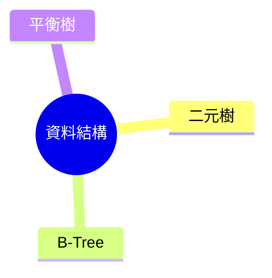

# 📌 AI Agent 任務說明文件：修復與強化試題處理流程

> **目的**：徹底排除題目格式錯誤、心智圖顯示異常，以及學習資料處理結果在前端呈現不正常的問題，同時為後續擴充功能奠定穩定基礎。

---

## ✅ 總目標

1. **題目與學習資料** 均能正確格式化為 Markdown，程式碼區塊排版／語法高亮無誤。  
2. **心智圖** 必須同時寫入資料庫、並於 HTML 頁面正常渲染。  
3. **模擬題參考答案** 不再出現「This is not included in the prompt.」。  
4. **學習資料重點摘要** 在前端呈現為結構化 HTML，而非純文字 JSON。  
5. 所有 **資料庫寫入** 及 **函式呼叫** 的參數型態、大小寫保持一致，避免隱性錯誤。

---

## 🧩 任務 1：修復程式碼區塊排版錯誤

|              | 說明 |
|--------------|------|
| **問題** | 將題目轉 Markdown 時，反引號區塊（\`\`\`）的縮排、換行消失。 |
| **目標** | 1️⃣ 保留原始換行與縮排 2️⃣ 確保程式碼以三反引號包裹並標註語言 3️⃣ 避免被意外轉成單行文字或 HTML 片段 |

---

## 🎨 任務 2：新增程式碼區塊語法高亮

|              | 說明 |
|--------------|------|
| **需求** | 為所有題目與參考解答中的程式碼，自動偵測語言並加入語法高亮。 |
| **細節** | - 偵測 `python` / `c` / `pseudocode`… - 輸出示例：   \`\`\`markdown   \`\`\`python   def hello():       print("Hello")   \`\`\`   \`\`\` |

---

## 🧠 任務 3：心智圖自動產生並正常顯示

|              | 說明 |
|--------------|------|
| **現象** | 心智圖只寫入 DB，HTML 無顯示。 |
| **目標** | 1️⃣ 在「單題與模擬題建立／更新」流程中呼叫心智圖產生器 2️⃣ 將 Mermaid 語法同時：   - 儲存於 DB   - 注入題目 Markdown，讓 HTML 直接渲染 3️⃣ 根節點＝題目主題；子節點＝知識點／標籤 |

**範例**：

---

## 📄 任務 4：修復learning-summary模擬題參考答案錯誤訊息

|              | 說明 |
|--------------|------|
| **問題** | 生成模擬題時，參考答案常出現「This is not included in the prompt.」。 |
| **可能原因** | - Prompt 組裝缺漏原始題目的關鍵內容 - 回傳 JSON schema 與解析邏輯不一致 |
| **修復重點** | 1️⃣ 檢查 Prompt 生成流程，確保題幹＋背景＋限制條件完整 2️⃣ 驗證大模型回傳欄位 `answer` 是否正確傳遞 3️⃣ 為錯誤訊息加上單元測試，避免回歸 |

---

## 📝 任務 5：修正learning-summaryAI生成的重點摘要在 HTML 的格式化

|              | 說明 |
|--------------|------|
| **現象** | 前端直接顯示 JSON 字串，無法閱讀，如： \`{"summary": "…", "key_concepts": […]}\` |
| **目標** | 1️⃣ 在後端將 JSON 轉為結構化 HTML（`<ul>`, `<li>`, `<h3>`…） 2️⃣ 或於前端 Vue/React 元件解析並渲染 3️⃣ 確保段落、列表、粗體／斜體格式正確顯示 |

---

## 🧪 任務 6：全面檢查參數傳遞與型別

|              | 說明 |
|--------------|------|
| **範圍** | - SQLite 寫入／讀取 - 內部 Python / TS 函式呼叫 - API Request & Response |
| **檢查重點** | 1️⃣ 大小寫一致（例如 `questionId` vs `questionID`） 2️⃣ 型別一致（`int` ≠ `str`） 3️⃣ 傳入 DB 的欄位符合 schema（避免 TEXT 寫入預期為 INTEGER 的欄位） |
| **驗證方式** | - 加入型別標註／Pydantic schema - 自動化測試覆蓋常見欄位錯誤 |

---

