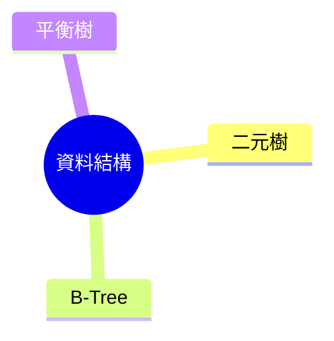

# 📌 AI Agent 任務說明文件：修復與強化試題處理流程

## ✅ 任務目標

請依據下列需求修正與擴充既有程式碼，確保試題的處理格式完整、具備語法高亮、心智圖生成功能正常，並且所有資料儲存時型態正確。

---

## 🧩 任務 1：修復程式碼格式排版錯誤

### 問題描述
目前在將題目格式化為 markdown 時，當題目中含有「程式碼區塊」或「虛擬碼區塊」時，原始排版會消失或變形，導致：

- 原始題目無法忠實呈現
- 程式碼無法正確顯示為 block

### 修復目標
- 正確偵測並保留原始程式碼區塊（例如：以反引號 ``` 包裹的內容）
- 排版時保留換行與縮排，避免被壓平成一行
- Markdown 輸出中正確使用三反引號 ``` + 語言標記（如 `python`, `c`, `pseudocode` 等）

---

## 🎨 任務 2：新增程式碼區塊高亮顯示功能

### 功能需求
為所有 **題目內容** 與 **參考解答** 中的程式碼區塊，自動加上語言高亮（Syntax Highlight）。

### 要求細節
- 偵測程式碼區塊內容的語言（如 `python`, `c`, `pseudocode` 等），並在 Markdown 中標記語言
- 確保輸出顯示於前端（如 web 或 markdown viewer）時使用合適的顏色配色（避免亮底亮字或暗底暗字）
- 避免將程式碼轉換成單行或 HTML 片段

✅ 範例格式：
````markdown
```python
def hello():
    print("Hello, world!")
```
````

---

## 🧠 任務 3：每一題都要自動生成對應心智圖

### 背景
心智圖生成功能的程式碼已實作完成，僅缺少將其串入單題處理流程中。

### 任務需求
- 於每一題建立或更新時，皆自動觸發對應的 Mermaid.js 心智圖生成
- 將心智圖 markdown 結果附加於每一題的 Markdown 輸出中
- 心智圖的根節點應為該題主題，分支為各知識點（可來自標籤、分類、主題分析）

✅ 範例格式（純 Mermaid 語法）：


---

## 🧪 任務 4：參數與型別檢查（特別注意 SQLite）

### 檢查內容
- 檢查所有函式與模組的參數傳遞
- 針對大小寫、資料型別（如 `str` vs `int` vs `bool`）進行一致性驗證
- 對 SQLite 資料寫入操作，需檢查：
  - 欄位名稱與資料結構一致
  - 型態轉換是否準確（例如：`datetime` 應轉為 ISO 格式或 timestamp）
  - 不得直接將非序列化的 `dict` 或 `list` 寫入 `TEXT` 欄位中（應轉為 JSON 字串）

✅ 具體請關注：
- INSERT 時資料型別對應
- SELECT/UPDATE 時是否有欄位名大小寫錯誤
- 所有 ID、KEY 類欄位是否統一使用 string 或 int，並保持一致