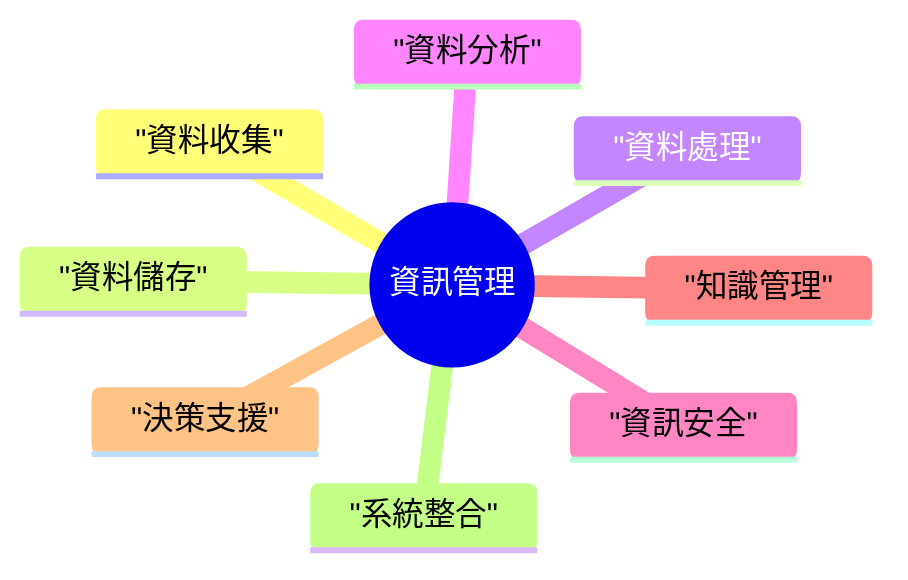

# 題庫匯出

匯出時間: 2025-08-02 12:29:03

## 題目 1 (ID: 56b3a3d1-17e9-44d4-8f83-e31f7d43a15f)

**考科:** 資訊管理
**來源:** 114MIS.pdf

### 題目內容

請您以一個線上客服系統來舉例，例如，現在有一位顧客小明，進入一家電商的線上客服系統，他想詢問關於他最近購買的一台筆記型電腦的退貨政策，以及他訂單的最新進度。請說明在這個典型的生成式 AI 的運用情境裡，RAG（Retrieval-Augmented Generation，擷取增強生成）以及 MCP（Model Context Protocol，模型上下文協定）可以分別扮演什麼樣的角色？

### 參考答案

###

一、前言
在當前數位化浪潮下，生成式人工智慧（Generative AI）已廣泛應用於線上客服系統，以提升服務效率與顧客體驗。然而，生成式模型本身可能存在「幻覺」（hallucination）問題，且缺乏即時、特定領域的知識。為解決此挑戰，RAG（Retrieval-Augmented Generation，擷取增強生成）與MCP（Model Context Protocol，模型上下文協定）扮演了關鍵角色。茲以顧客小明在電商線上客服系統中查詢退貨政策與訂單進度為例，闡述RAG與MCP在此情境中的具體應用與功能。

二、生成式AI線上客服系統情境分析
(一) 顧客需求
顧客小明進入電商線上客服系統，其主要需求為：
1.  查詢最近購買筆記型電腦的退貨政策。
2.  查詢該筆訂單的最新進度。

(二) 系統挑戰
面對小明的需求，生成式AI客服系統需克服以下挑戰：
1.  **知識準確性與即時性：** 退貨政策需精確且符合公司最新規定；訂單進度則為即時變動的個人化資訊，非模型預訓練資料所能涵蓋。
2.  **對話連貫性與上下文理解：** 系統需能理解小明後續的追問，並將其與先前的對話內容（例如訂單編號、商品名稱）連結，以提供精準回應。

三、RAG（擷取增強生成）之角色
(一) 概念說明
RAG是一種結合資訊擷取（Retrieval）與生成（Generation）的技術框架。其核心理念是，在生成式模型產生回應之前，先從外部知識庫中擷取相關且可靠的資訊，再將這些資訊作為上下文（context）輸入給生成式模型，引導其生成更準確、更具事實依據的回應。這有助於減少模型幻覺，並納入模型訓練時未包含的最新或特定領域知識。

(二) 在小明情境中的應用
1.  **退貨政策查詢：**
```pseudocode
    *   當小明詢問「退貨政策」時，RAG模組會觸發資訊擷取流程。
    *   系統會從電商的官方文件資料庫（例如：PDF格式的退貨政策文件、FAQ頁面、公司內部知識庫等）中，搜尋與「退貨政策」、「筆記型電腦退貨」等關鍵字相關的條款與說明。
    *   RAG會將擷取到的相關政策條文（例如：退貨期限、商品狀態要求、退款流程等）作為補充資訊，連同小明的原始問題，一併提供給生成式AI模型。
    *   生成式AI模型基於這些擷取到的事實資訊，生成清晰、準確且符合公司規定的退貨政策說明。
```
2.  **訂單進度查詢：**
```pseudocode
    *   當小明提供訂單編號或系統透過其登入資訊自動識別其訂單時，RAG模組會被啟用。
    *   RAG會向電商的後端訂單管理系統（Order Management System, OMS）或物流追蹤系統發出查詢請求，以擷取該特定訂單的即時狀態（例如：已出貨、運送中、已送達、退貨處理中等）及相關物流資訊。
    *   擷取到的即時訂單數據會被整合進生成式AI模型的輸入中，使其能夠生成如「您的訂單[訂單編號]目前狀態為『已出貨』，預計於[日期]送達，物流單號為[單號]」等個人化且即時的回應。
```

(三) 效益
*   **提升資訊準確性：** 確保客服回應基於最新、最可靠的企業內部資料。
*   **減少幻覺：** 避免生成式模型憑空捏造不存在的政策或資訊。
*   **提供個人化服務：** 能夠針對特定顧客的訂單提供即時、精確的狀態更新。

四、MCP（模型上下文協定）之角色
(一) 概念說明
MCP（Model Context Protocol）指的是在生成式AI系統中，用於管理、組織與傳遞對話上下文資訊給大型語言模型（LLM）的一套協定或機制。它確保LLM在多輪對話中能維持連貫性、理解語境，並有效利用有限的上下文視窗（context window）。MCP負責決定哪些歷史對話、哪些外部擷取資訊應被納入當前模型的輸入，以及如何格式化這些資訊以供模型最佳理解。

(二) 在小明情境中的應用
1.  **維持對話連貫性：**
```pseudocode
    *   當小明先詢問退貨政策，隨後又問「那運費怎麼算？」時，MCP會確保「運費」這個問題被理解為與「退貨政策」相關的子問題。
    *   MCP會將先前的對話內容（例如：小明提及的筆記型電腦、退貨政策的討論）保留在上下文視窗中，或以摘要形式傳遞給模型，使模型能理解「運費」是指退貨產生的運費，而非一般商品的運費。
```
2.  **整合外部資訊：**
```pseudocode
    *   RAG模組擷取到的退貨政策條文或訂單即時狀態，需要透過MCP的協定，以適當的格式（例如：特定的標籤、分隔符號或結構化文本）注入到生成式AI模型的輸入提示（prompt）中。
    *   MCP確保這些外部資訊能被模型正確識別為事實依據，並據此生成回應，而非將其視為一般對話內容。
```
3.  **管理上下文視窗：**
```pseudocode
    *   大型語言模型的上下文視窗大小有限。在長時間的對話中，MCP會負責策略性地管理上下文，例如：
        *   **摘要化：** 將冗長的歷史對話進行摘要，保留核心資訊。
        *   **篩選：** 移除與當前問題無關的歷史對話片段。
        *   **優先級排序：** 確保最相關、最新的資訊（包括RAG擷取結果）優先被納入上下文。
    *   這有助於避免上下文溢出，同時確保模型始終能接收到最相關的資訊，以維持對話品質與效率。
```

(三) 效益
*   **提升對話連貫性：** 使多輪對話更自然、流暢，避免模型「失憶」。
*   **優化模型效能：** 有效利用有限的上下文視窗，提升模型處理複雜對話的能力。
*   **強化資訊整合：** 確保RAG擷取到的外部資訊能被模型有效利用，生成精準回應。

五、結論
在小明查詢退貨政策與訂單進度的線上客服情境中，RAG與MCP共同協作，構成了生成式AI客服系統的關鍵支柱。RAG負責從外部知識庫和即時資料源中「擷取」精確、最新的事實資訊，解決了生成式模型知識不足與幻覺問題；而MCP則負責「管理」這些資訊與對話歷史，確保模型能有效利用上下文，維持對話的連貫性與理解深度。兩者相輔相成，使得線上客服系統能夠提供既準確又個人化，且具備良好對話體驗的服務，大幅提升顧客滿意度與營運效率。

### 相關知識點

- RAG (Retrieval-Augmented Generation)
- MCP (Model Context Protocol)
- 生成式 AI (Generative AI)
- 線上客服系統 (Online Customer Service System)

### 心智圖



---

